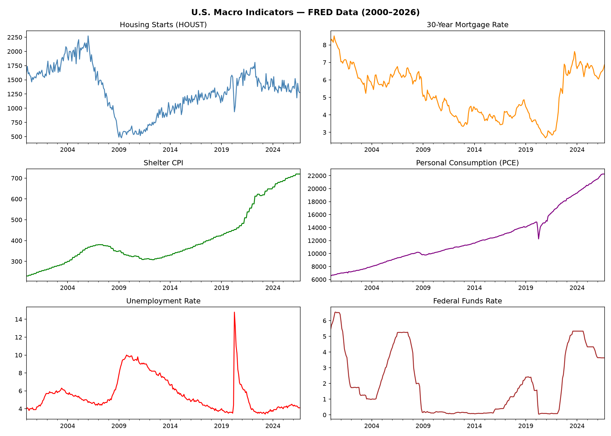
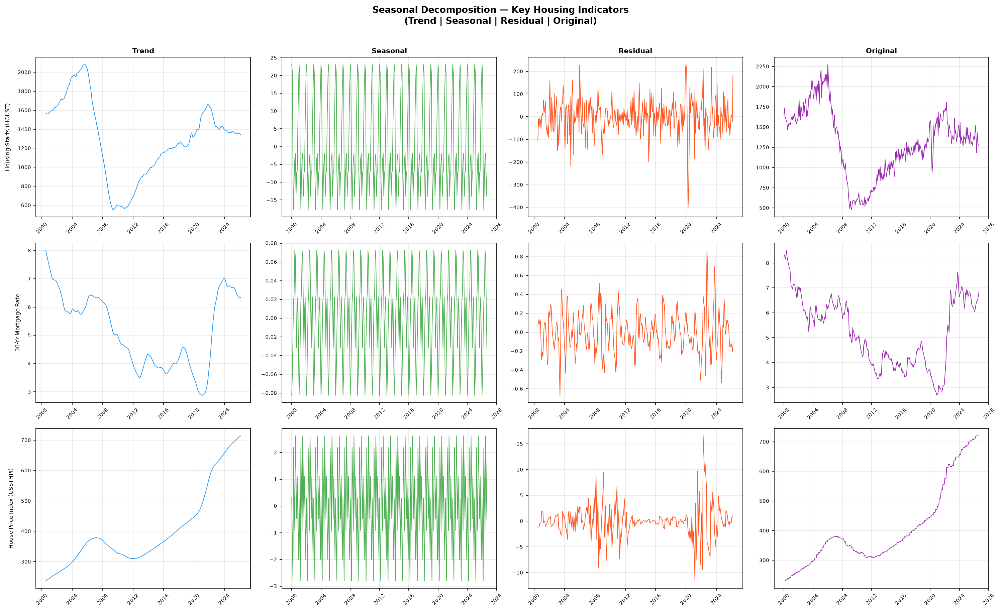
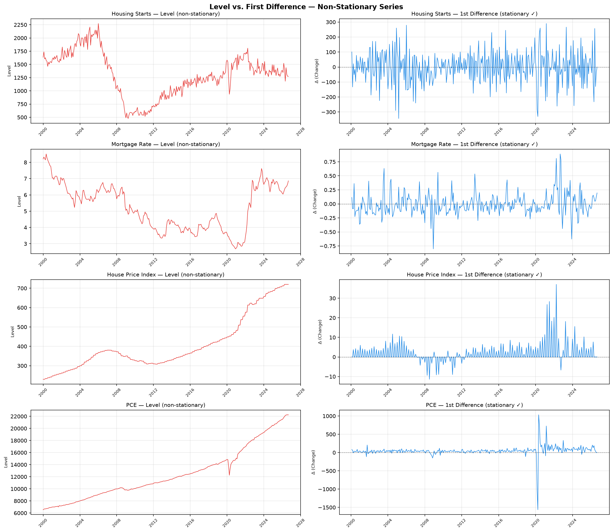
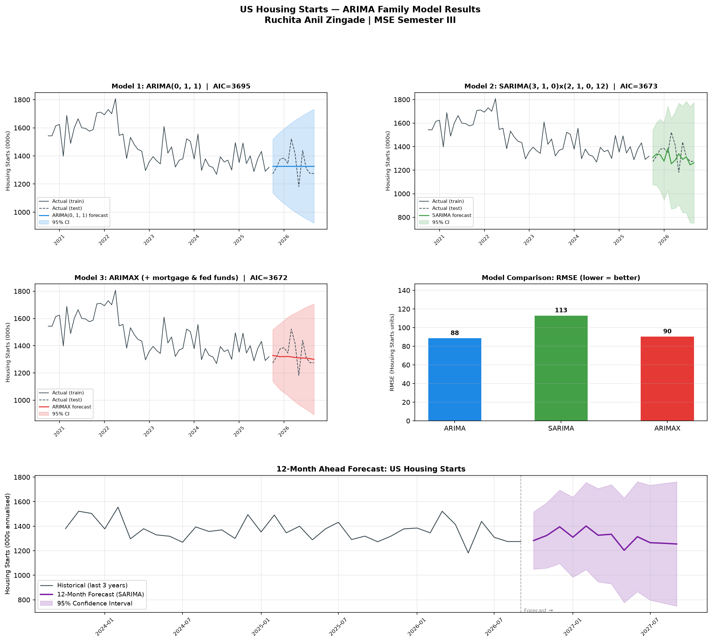
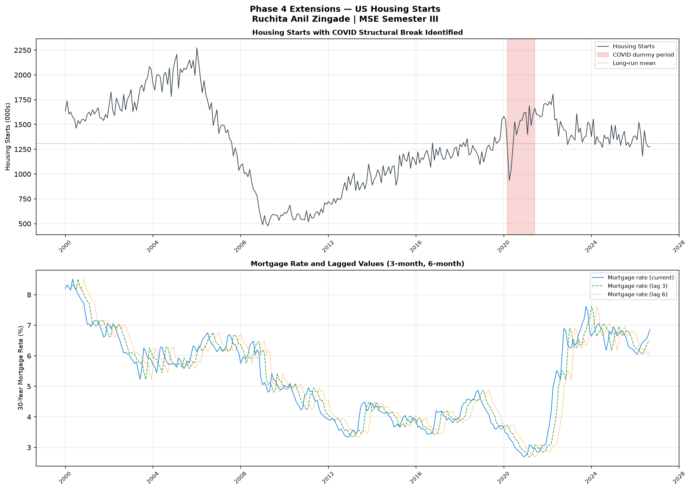

# US Housing & Consumer Market Indicators: Time Series Analysis

**Ruchita Anil Zingade | MA Economics, Madras School of Economics (Semester III)**  
**Course: Applied Macro and Financial Econometrics**

---

## Project Overview

This project analyses the dynamics of the US residential housing market using monthly macroeconomic data from the Federal Reserve Economic Data (FRED) database, spanning January 2000 to September 2026 (321 observations).

The central research question is:

> **Do monetary policy changes, specifically mortgage rate movements — predict housing starts, and if so, with what transmission lag?**

The analysis proceeds in four phases, from raw data extraction through ARIMA/ARIMAX modelling and sub-national extensions, combining classical time series econometrics with model diagnostics.

---

## Key Findings

- US housing starts follow an **ARIMA(0,1,1)** process a single lagged shock carries over month to month after first differencing
- **Granger causality** from mortgage rates to housing starts is significant at lag 6 (F=2.803, p=0.011), but not at lags 1 or 3, consistent with a 6-month monetary policy transmission lag
- **Lagged ARIMAX** confirms: mortgage rate at t-3 (coef=-62.5, p=0.003) and t-6 (coef=-73.4, p=0.002) are both highly significant; the contemporaneous rate is not (p=0.34)
- A **COVID structural break dummy** (March 2020 to June 2021) is highly significant (coef=-109.5, p=0.002), isolating the pandemic shock from underlying market dynamics
- **12-month forecast** (Oct 2026 to Sep 2027): housing starts projected in the range of 1,204 to 1,402 thousand units annualised

---

## Data Sources

All data extracted via the [FRED API](https://fred.stlouisfed.org/) (fredapi, Python):

| Variable | FRED Series | Description |
|----------|------------|-------------|
| Housing Starts | `HOUST` | New residential units started (000s, annualised, monthly) |
| 30-Yr Mortgage Rate | `MORTGAGE30US` | Weekly average, interpolated to monthly |
| US House Price Index | `USSTHPI` | All-transactions HPI (used as shelter price proxy) |
| Personal Consumption | `PCE` | Personal Consumption Expenditures ($bn) |
| Unemployment Rate | `UNRATE` | Civilian unemployment rate (%) |
| Fed Funds Rate | `FEDFUNDS` | Effective federal funds rate (%) |

**Period:** January 2000 to September 2026 | **Frequency:** Monthly



---

## Project Structure

```
US_housing/
|
+-- phase1_data_pull.py          # FRED API extraction + cleaning
+-- phase2_stationarity.py       # Seasonal decomposition + ADF stationarity tests
+-- phase3_arima.py              # ARIMA / SARIMA / ARIMAX modelling + 12M forecast
+-- phase4_extensions.py         # Granger causality + COVID dummy + lagged ARIMAX
|
+-- timeseries_analysis.ipynb    # Time series methods applied to FRED data
|                                  (White noise, AR, MA, ARMA, ARIMA, ARIMAX)
|
+-- outputs/
|   +-- fred_data.csv                  # Raw extracted data
|   +-- fred_data_prepared.csv         # Cleaned + differenced data (model-ready)
|   +-- stationarity_summary.xlsx      # ADF test results for all series
|   +-- arima_results.xlsx             # Model comparison, forecast, coefficients
|   +-- phase4_results.xlsx            # Granger causality, lagged ARIMAX, comparison
|   |
|   +-- decomposition_plots.png        # Trend / seasonal / residual decomposition
|   +-- stationarity_comparison.png    # Level vs. first-differenced series
|   +-- arima_results.png              # ARIMA/ARIMAX model outputs + forecast chart
|   +-- phase4_extensions.png          # COVID dummy + lagged mortgage rate visuals
|
+-- README.md
```

---

## Methods

### Phase 1: Data Extraction
Monthly FRED data pulled via API for 6 macroeconomic series. Missing values handled via forward-fill (2 months or fewer); series aligned to a common monthly index.

### Phase 2: Decomposition and Stationarity
- **Seasonal decomposition** (additive model, period=12): trend, seasonal, and residual components extracted for housing starts, mortgage rate, and HPI
- **Augmented Dickey-Fuller (ADF) test** applied to all series at level and after first differencing
- Housing starts: p=0.47 at level (non-stationary) → p<0.001 after first differencing (stationary) → integrated of order I(1)





### Phase 3 — ARIMA / SARIMA / ARIMAX Modelling
Train/test split: last 12 months held out for out-of-sample evaluation.

| Model | Specification | AIC | Test RMSE |
|-------|--------------|-----|-----------|
| ARIMA | (0,1,1) | 3694.6 | 88.5 |
| SARIMA | (3,1,0)x(2,1,0,12) | 3673.3 | 112.9 |
| **ARIMAX** | **(0,1,1) + mortgage + fed funds** | **3672.2** | **90.3** |

ARIMAX selected as best model by AIC. 12-month forecast produced using SARIMA refitted on full sample.



### Phase 4: Extensions

**Granger Causality Test**
- Mortgage rate to housing starts: significant at lag 6 (p=0.011)
- Reverse direction (starts to mortgage rate): significant at lags 1 to 3, indicating bidirectionality consistent with monetary policy endogeneity

**COVID Structural Break**
- Binary dummy = 1 for March 2020 to June 2021 added to ARIMA(0,1,1)
- Coefficient: -109.5 (p=0.002) pandemic suppressed starts by approximately 110,000 units/month on average

**Lagged ARIMAX**
- Mortgage rate at t-3 and t-6 included alongside contemporaneous rate, fed funds, and COVID dummy
- Results confirm 3 to 6 month monetary policy transmission lag; contemporaneous rate insignificant



---

## Reproducibility

### Requirements
```
Python 3.9+
fredapi
pandas
numpy
matplotlib
statsmodels
pmdarima
openpyxl
```

### Setup
```bash
# Clone the repo
git clone https://github.com/ruchitaanil03/us-housing-timeseries.git
cd us-housing-timeseries

# Create virtual environment
python3 -m venv myenv
source myenv/bin/activate        # Mac/Linux
myenv\Scripts\activate           # Windows

# Install dependencies
pip install fredapi pandas numpy matplotlib statsmodels pmdarima openpyxl jupyter

# Run phases in order
python3 phase1_data_pull.py
python3 phase2_stationarity.py
python3 phase3_arima.py
python3 phase4_extensions.py

# Open the time series analysis notebook
jupyter notebook timeseries_analysis.ipynb
```

**FRED API Key:** A free key is required. Register at [fred.stlouisfed.org/docs/api/api_key.html](https://fred.stlouisfed.org/docs/api/api_key.html) and replace the `FRED_API_KEY` variable in `phase1_data_pull.py`.

---

## Economic Motivation

The analysis is motivated by the housing market's central role in consumer spending and home improvement retail. Key transmission mechanisms examined:

1. **Rate → Permits → Starts:** A mortgage rate rise raises financing costs, reducing permit applications; this flows through to housing starts with a 3 to 6 month lag
2. **Starts → Home improvement demand:** New construction and housing transactions are the primary driver of large-ticket home improvement spending (flooring, appliances, fixtures)
3. **Sun Belt concentration:** Post-pandemic migration patterns have concentrated US housing supply growth in Atlanta, Dallas, Phoenix, and Houston — markets characterised by high housing turnover and above-average home improvement expenditure per household

---

## Limitations and Future Work

- **Contemporaneous exogeneity:** Mortgage rate and fed funds are treated as exogenous; in practice, the Fed responds to economic conditions that also affect housing. A structural VAR framework would address this.
- **ARCH/GARCH:** Volatility clustering in housing starts residuals is not modelled here; conditional heteroskedasticity models are a natural extension.
- **MSA-level modelling:** Individual ARIMA models per metro and panel time series approaches are left for future work.
- **Supply-side variables:** Lumber costs, construction employment, and zoning stringency indices are omitted; their inclusion would improve structural interpretation.

---

## Author

**Ruchita Anil Zingade**  
MA Economics (2025-27), Madras School of Economics, Chennai
Email: ge25ruchita@mse.ac.in

---

*Data: Federal Reserve Bank of St. Louis (FRED). All analysis conducted in Python 3. Charts generated with matplotlib and statsmodels.*
